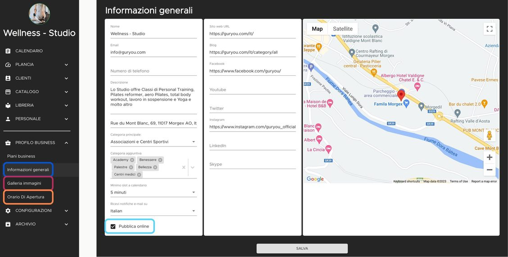

Se hai già ricevuto la conferma della registrazione, puoi configurare il tuo profilo.

## Ecco come procedere 
(ti consigliamo di utilizzare Google Chrome):

- Accedi al tuo account e inserisci le credenziali.
- Clicca su "Profilo Business" e completa "Informazioni generali" e "Orario di apertura".

- Aggiungi foto in "Galleria immagini".
- Vai su "Personale" per aggiungere eventuali collaboratori e i loro orari di lavoro.
- Vai su “Catalogo” e aggiungi i tuoi "Servizi", "Corsi" ed "Eventi". Ricordati, il cliente prenota sulla base della tua disponibilità impostata.

Quando hai completato del tuo profilo, torna su  “Profilo business” -  "Informazioni generali", metti il flag su “Pubblica online” e salva.

[Accedi e Configura il tuo profilo ora](https://youdeal.guryou.com/login).

Complimenti, il tuo profilo è visibile ai tuoi clienti su YouFeel! :tada: